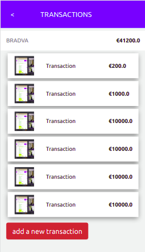
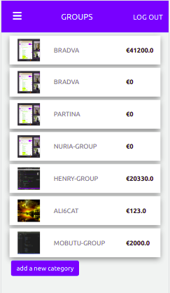
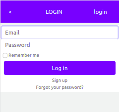

# Capstone App

The Ruby on Rails capstone project is about building a mobile web application where you can manage your budget: you have a list of transactions associated with a group, so that you can see how much money you spent and on what.

We created a Ruby on Rails application that allows the user to:

- register and log in, so that the data is private to them.
- introduce new transactions associated with a group.
- see the money spent on each category.





Additional description about the project and its features.

## Built With
Ruby 
Ruby on Rails

## Getting Started
To get a local copy up and running follow these simple example steps.

### Prerequisites
Ruby: 2.6.3 Rails: 5.2.3 Postgres: >=9.5

### Setup
Install gems with:
```javascript
bundle install
```
Setup database with:
```javascript
rails db:create
rails db:migrate
rails db:seed
```
### Usage
Start server with:
```javascript
rails server
```
Open http://localhost:3000/ in your browser.

### Run tests
Install npm with:
```javascript
npm i
```
Install rspec with:
```javascript
bundle install
```
and
```javascript
rails generate rspec:install
```

### run the test with:
```javascript
rspec spec
```

## Live Demo

[Live Demo Link](https://livedemo.com)

## Authors

👤 **Azaria SAIDI ALLY**

- GitHub: [@azy64](https://github.com/azy64)
- LinkedIn: [LinkedIn](https://www.linkedin.com/in/azaria-saidi-524780112/)

## 🤝 Contributing

Contributions, issues, and feature requests are welcome!

Feel free to check the [issues page](../../issues/).

## Show your support

Give a ⭐️ if you like this project!

## Acknowledgments

- Hat tip to anyone whose code was used
- Inspiration
- etc

## 📝 License

This project is [MIT](./MIT.md) licensed.